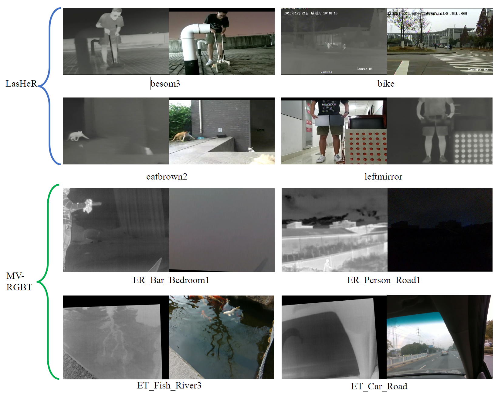
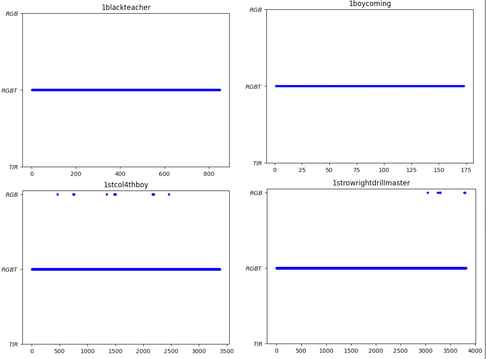
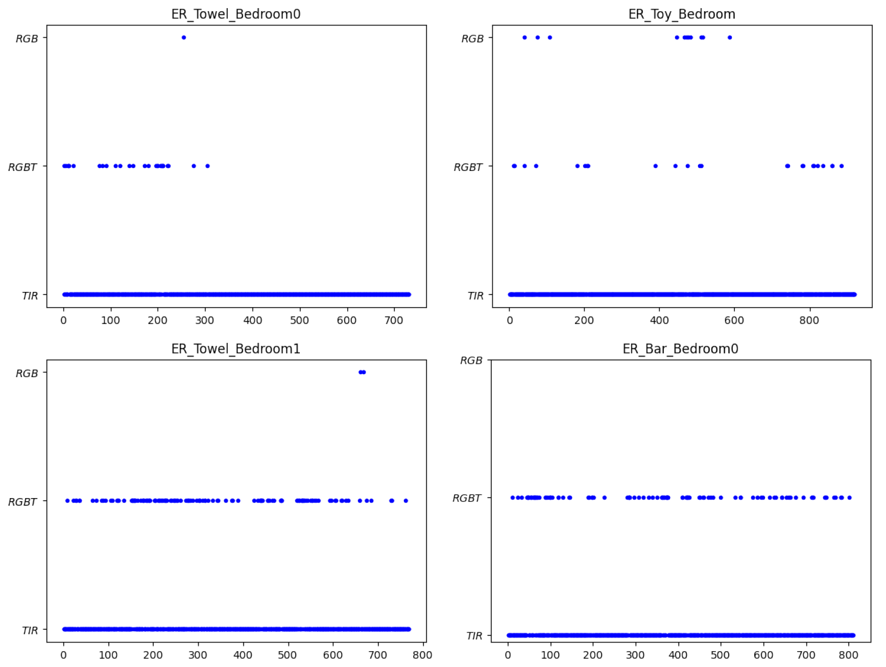

# Motivation

# 🍰Contributions
(1) A new benchmark, MV-RGBT, is collected to make it representative of multi-modal warranting scenarios, filling the gap between the data in current benchmarks and imaging conditions which motivate RGBT tracking.

(2) A new problem, `when to fuse', is posed to develop reliable fusion strategies for RGBT trackers, as in MMW scenarios multi-modal information fusion may be counterproductive. To facilitate its discussion, a new solution, MoETrack, with multiple tracking experts is proposed. It performs state-of-the-art on several benchmarks, including MV-RGBT, LasHeR, and VTUAV-ST.

(3) A new compositional perspective for method evaluation is provided by categorising MV-RGBT into two subsets, MV-RGBT-RGB and MV-RGBT-TIR, promoting a novel in-depth analysis and offering insightful recommendations for future developments in RGBT tracking.

🫵Find our survey work at [repo](https://github.com/Zhangyong-Tang/Survey-for-MultiModal-Visual-Object-Tracking)

## Benchmark Data Comparison
### ⭐ MV-RGBT will be published after this work accepted!

## Selection Results

LasHeR:
---

MV-RGBT:
---

⭐ More detailed introduction of the proposed method, MoETrack, is available [here](https://github.com/Zhangyong-Tang/MoETrack)

